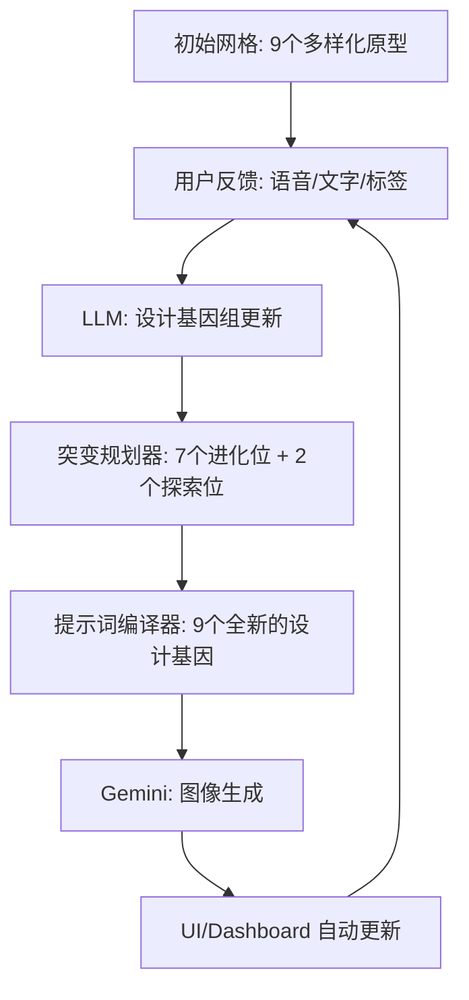

# 自动化主动设计发现工作流 (Automated Active Discovery Workflow)

本系统旨在通过“图像生成-反馈-进化”的闭环，在最少的交互轮次内挖掘出用户潜意识中的“梦中情车”设计。

## 1. 核心闭环 (The Loop)

## 2. 累积学习机制 (Global Design DNA)

系统不是孤立地处理每一轮反馈，而是维护一个全局的状态（Design Genome）：
- **确认喜好 (Confirmed Likes)**：用户明确表达过喜欢的元素（如：长车头、贯穿灯带）。
- **硬性雷区 (Hard Rejections)**：用户明确反感的设计（如：尾翼、传统进气格栅、笨重感）。
- **信息缺口 (Information Gaps)**：尚未探索的视觉领域，用于指导探索位生成。

## 3. "7+2" 生成策略

每一轮生成的 9 张候选图中，包含两种目的：
- **7个进化位 (Exploitation, 70%)**：
    - **直接突变**：针对上一轮最受好评的图片进行细节微调（Delta Variation）。
    - **混合突变**：将历史上的高分元素进行杂交（例如：A的姿态 + B的灯带）。
- **2个探索位 (Exploration, 20%)**：
    - **疯狂创意 (Wildcards)**：引入完全不现实或极端的几何形状，用来测试用户的审美边界，防止模型过早收敛到局部最优解。

## 4. 交互哲学

- **视觉为主，语言为辅**：用户不需要懂设计术语，只需要通过眼睛选择，语言只需表达最直观的好恶。
- **控制变量对比**：通过微小的 Delta 变化，让用户在对比中逐渐明确自己的真实偏好。
